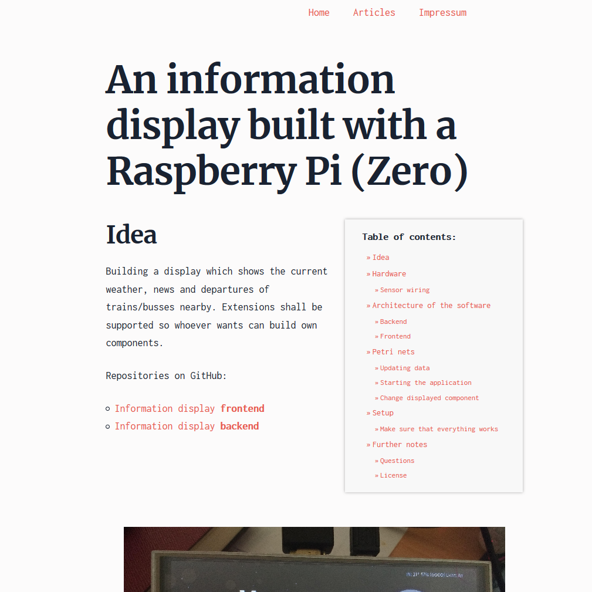

# Simpl Theme

The **Simpl** Theme is for [Grav CMS](http://github.com/getgrav/grav).

## Install
### Install manually

Download the [latest release](https://github.com/denniskawurek/grav-theme-simpl/releases/latest).
Unzip it in your `user/themes` folder and rename the folder to `simpl`.
Login to Grav and activate the theme in your `Themes` section.

## Description

Simpl is using [Skeleton](http://getskeleton.com/) as CSS framework.
Fonts are [Merriweather](https://fonts.google.com/specimen/Merriweather) and [Inconsolata](https://fonts.google.com/specimen/Inconsolata). Both are licensed under the [Open Font License](http://scripts.sil.org/cms/scripts/page.php?site_id=nrsi&id=OFL_web).

Read the [Grav documentation](https://learn.getgrav.org/themes/theme-tutorial) to configure the theme yourself.

## Customize

To edit the main navigation you need to edit the file in `\templates\partials\navigation\navigation.html.twig`.

Show Table of Contents on your page. If you want to do this, you need to install the TOC plugin [TOC plugin](https://github.com/sommerregen/grav-plugin-toc).
And on the pages you want to use it, you have to write `[TOC]` in your markdown code.
